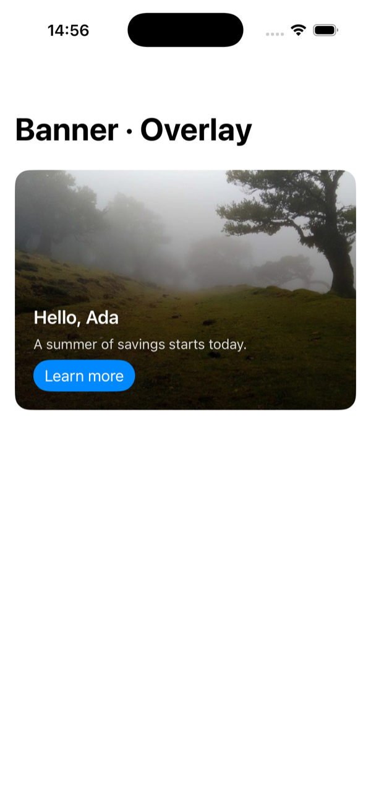
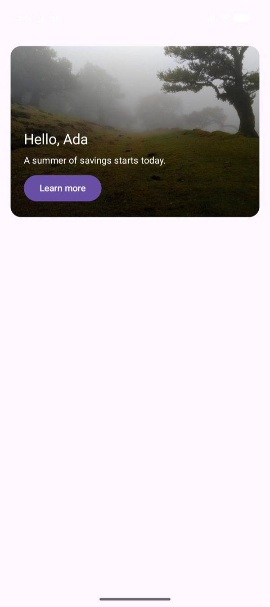
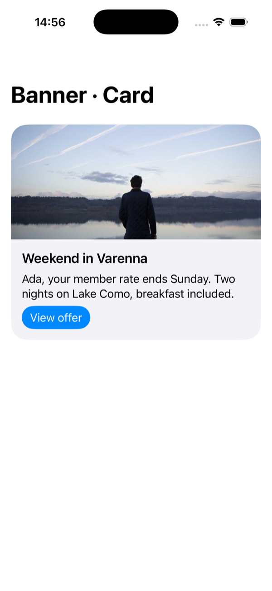
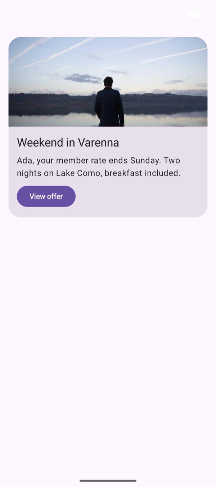
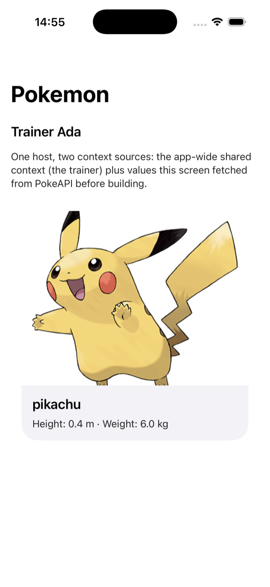
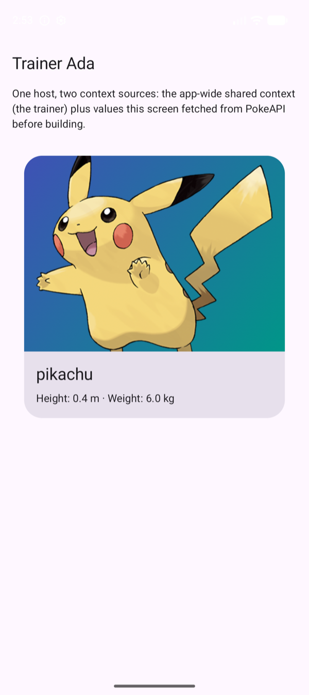

# Samples

The three sample apps, `samples/swiftui`, `samples/compose`, and `samples/react-native`, ship the same demos rendered from the same documents: what differs is only the design system doing the drawing. The screenshots below are two of the apps running the identical JSON, side by side.

Every demo can be opened directly, which is also how these screenshots were taken:

- **iOS**: set the `MILANO_SCREEN` environment variable on the run scheme (`quickstart`, `banner`, `banner-card`, `banner-strip`, `form`, `tip-calculator`, `checkbox-gate`, `pokemon`, `profile`, `catalog`, `embedded`, `interstitial`).
- **Android**: pass the same key as a launch extra: `adb shell am start -n dev.getmilano.sample/.MainActivity -e milano_screen pokemon`.
- **React Native**: `EXPO_PUBLIC_MILANO_SCREEN=pokemon npm start`, with the same values.

## Banner · Overlay

One document, [`banner.json`](https://github.com/get-milano/sdk/blob/main/samples/swiftui/Resources/banner.json): a `Banner` with a remote background image, text drawn over a scrim, and a `Button` whose `tap` dispatches an `openUrl` action to the host. The greeting is an expression over the app-wide shared context (`concat('Hello, ', context.userName)`).

  
  

## Banner · Card

The same component, different declared layout: [`banner-card.json`](https://github.com/get-milano/sdk/blob/main/samples/swiftui/Resources/banner-card.json) asks for `"layout": "card"`, and each design system interprets that in its own idiom. The document never changes per platform.

  
  

## Pokemon · Screen context

[`pokemon.json`](https://github.com/get-milano/sdk/blob/main/samples/swiftui/Resources/pokemon.json) declares five context keys. One (`userName`) is satisfied by the app-wide shared context; the other four are fetched by the screen itself from [PokeAPI](https://pokeapi.co) and merged on top before building, on a key collision the screen wins. The artwork URL travels as an ordinary context string into the `Banner`'s `backgroundImageUrl`, and the height and weight lines are computed in the document with pure expressions (`str(context.pokemonHeight / 10.0)`).

This is the pattern for any screen that owns its data: fetch first, hand Milano plain values, let the gate validate everything at once. See the screen code: [`PokemonScreen.swift`](https://github.com/get-milano/sdk/blob/main/samples/swiftui/Sources/Screens/PokemonScreen.swift), [`PokemonScreen.kt`](https://github.com/get-milano/sdk/blob/main/samples/compose/app/src/main/kotlin/dev/getmilano/sample/ui/screens/PokemonScreen.kt), [`PokemonScreen.tsx`](https://github.com/get-milano/sdk/blob/main/samples/react-native/src/screens/PokemonScreen.tsx).

  
  

## The rest of the catalog

Also in all three apps, without screenshots here:

- **Quick start**: the one-view quick path from [Getting started](getting-started): inline vocabulary, inline document, one renderer, and the `MilanoHost` quick overload, with no shared engine.
- **Banner · Strip**: the third declared layout of the same `Banner` component.
- **Contact form**: `TextField`, `Checkbox`, conditional visibility, required markers, expression-driven validation, and a custom `submitContact` action whose handler returns a confirmation number: the declared `result` binds inside `onSuccess`, and the thank-you line shows it without any host UI code. The fields also report focus to the [analytics stream](analytics), and every screen's taps, dispatches, and outcomes arrive there automatically.
- **Tip calculator**: all math lives in the document as expressions over state; the host ships no logic.
- **Checkbox gate**: a checkbox writing state through `$set`, with `if(...)` expressions gating the button's label, enabled state, and a counter.
- **Embedded**: a Milano view between native components in a host screen.
- **Interstitial**: a full-screen document whose `dismiss` action is interpreted by the presenting screen.
- **Profile**: a whole user-profile screen as one document: identity from context (avatar, name, membership), settings as state behind `Checkbox` and `$set`, and a summary line computed by an expression. Declares `vocabulary.min: 1.1.0`, so an app holding an older vocabulary fails the build instead of rendering a half-understood profile.
- **Catalog**: an intermediate screen: a list of item `Card`s (image, name, blurb), each bound to `tap` with `openUrl`, so tapping an item opens its page through the host's action handler. Documents are data, so the producer enumerates the items; changing the catalog is publishing a new document. Each card also carries the sample's [accessibility](accessibility) set: a label and hint collapsing the card into one announced button, with the artwork marked decorative.

The React Native app adds one wrinkle the other two do not have: its documents are bundled as **text**, generated into `src/documents.generated.ts` by `npm run documents`. Milano distinguishes `int` from `double` and `JSON.parse` does not, so a JSON import would quietly retype a document on the way in.

## The web: the playground

There is no `samples/web` directory, because the [Playground](https://get-milano.dev/playground/) is the web example and a better one than a sample app would be: it hosts documents you write, with [Material UI](https://mui.com) as the design system, one renderer per component type. Its [source](https://github.com/get-milano/playground) shows the React binding doing everything at once, in about 700 lines:

- `src/renderers.tsx`: Material components wired to Milano, one renderer per type, plus a generic renderer for component types it has no mapping for.
- `src/engine.ts`: engine, registry, builder, and an action handler that leaves each dispatched action pending until a human settles it.
- `src/App.tsx`: `MilanoRenderedView`, a state inspector on `view.subscribe`, and both the occurrence and analytics streams.

The samples follow the architecture described in [Guidelines](guidelines); how renderers bind to the vocabulary is covered in [Bridge](bridge).
