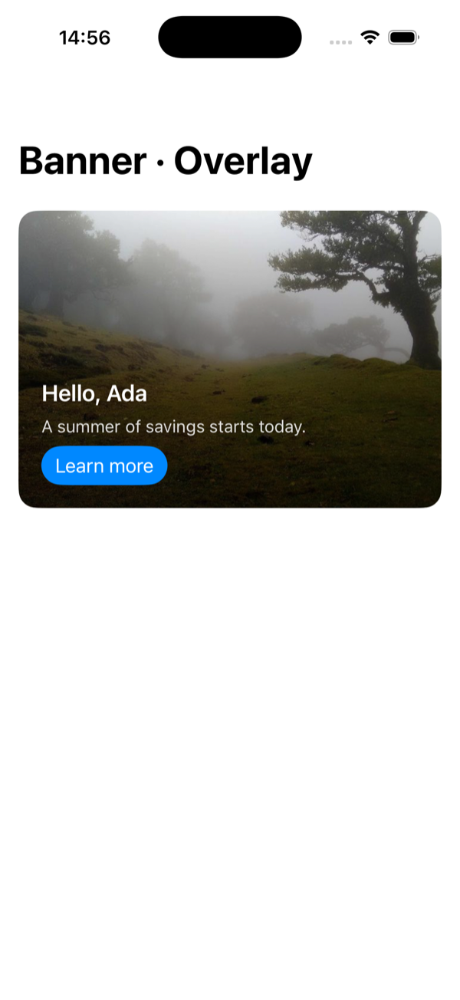
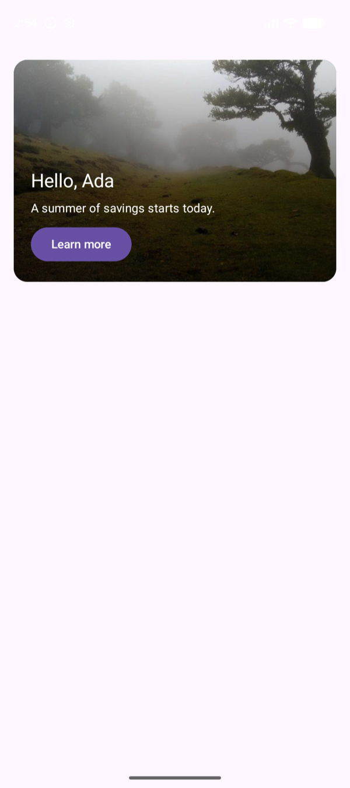
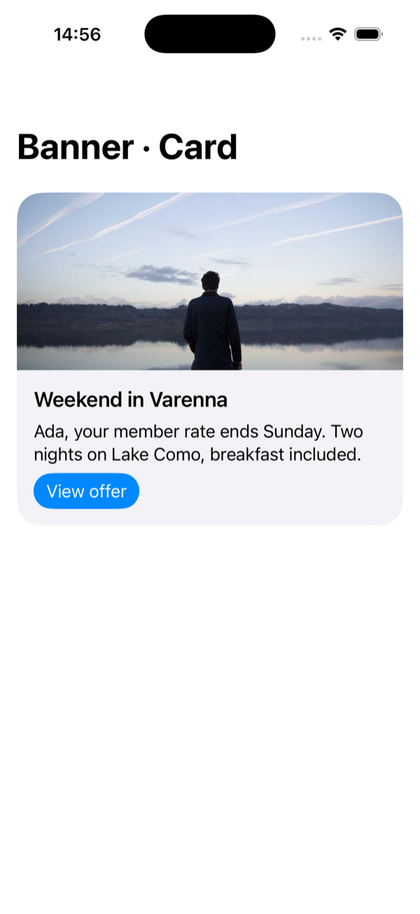
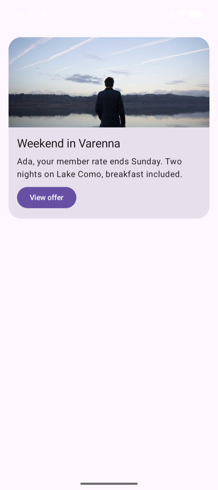
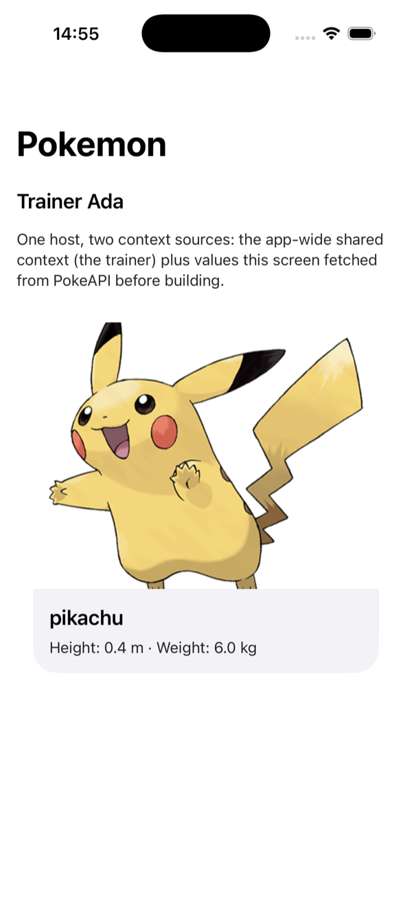
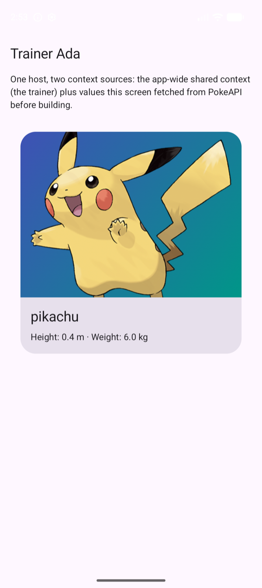

# Samples

The four sample apps, `samples/swiftui`, `samples/compose`, `samples/compose-desktop`, and `samples/react-native`, ship the same demos rendered from the same documents: what differs is only the design system doing the drawing. The screenshots below are two of the apps running the identical JSON, side by side.

All four run the Milano CLI as a build step, so they need **Node** to
build: the typed bindings and the editor schema are regenerated from the
vocabulary and every bundled document is validated with the same gate the
engines run, before any compilation.

Xcode and Android Studio do not see a login shell's PATH. They inherit
the environment of whatever launched them, so a Node installed by nvm,
fnm, volta, asdf, or mise works in every terminal and is still invisible
to a build started from the Dock. The samples look in those managers'
locations themselves, so this normally needs no attention. When yours
lives somewhere else, name it once with `MILANO_NODE`:

```sh
export MILANO_NODE=$(command -v node)                                   # Gradle
echo "export MILANO_NODE=$(command -v node)" > Scripts/.xcode.env.local # Xcode
```

Every demo can be opened directly, which is also how these screenshots were taken:

- **iOS**: set the `MILANO_SCREEN` environment variable on the run scheme (`quickstart`, `banner`, `banner-card`, `banner-strip`, `form`, `tip-calculator`, `checkbox-gate`, `pokemon`, `profile`, `catalog`, `quick-actions`, `embedded`, `interstitial`).
- **Android**: pass the same key as a launch extra: `adb shell am start -n dev.getmilano.sample/.MainActivity -e milano_screen pokemon`.
- **React Native**: `EXPO_PUBLIC_MILANO_SCREEN=pokemon npm start`, with the same values.

## Banner · Overlay

One document, [`banner.json`](https://github.com/get-milano/sdk/blob/main/samples/swiftui/Resources/banner.json): a `Banner` with a remote background image, text drawn over a scrim, and a `Button` whose `tap` dispatches an `openUrl` action to the host. The greeting is an expression over the app-wide shared context (`$concat('Hello, ', context.userName)`).

<p>
  
  
</p>

## Banner · Card

The same component, different declared layout: [`banner-card.json`](https://github.com/get-milano/sdk/blob/main/samples/swiftui/Resources/banner-card.json) asks for `"layout": "card"`, and each design system interprets that in its own idiom. The document never changes per platform.

<p>
  
  
</p>

## Pokemon · Screen context

[`pokemon.json`](https://github.com/get-milano/sdk/blob/main/samples/swiftui/Resources/pokemon.json) declares five context keys. One (`userName`) is satisfied by the app-wide shared context; the other four are fetched by the screen itself from [PokeAPI](https://pokeapi.co) and merged on top before building, on a key collision the screen wins. The artwork URL travels as an ordinary context string into the `Banner`'s `backgroundImageUrl`, and the height and weight lines are computed in the document with pure expressions (`$str(context.pokemonHeight / 10.0)`).

This is the pattern for any screen that owns its data: fetch first, hand Milano plain values, let the gate validate everything at once. See the screen code: [`PokemonScreen.swift`](https://github.com/get-milano/sdk/blob/main/samples/swiftui/Sources/Screens/PokemonScreen.swift), [`PokemonScreen.kt`](https://github.com/get-milano/sdk/blob/main/samples/compose/app/src/main/kotlin/dev/getmilano/sample/ui/screens/PokemonScreen.kt), [`PokemonScreen.tsx`](https://github.com/get-milano/sdk/blob/main/samples/react-native/src/screens/PokemonScreen.tsx).

<p>
  
  
</p>

## The rest of the catalog

Also in all four apps, without screenshots here:

- **Quick start**: the one-view quick path from [Getting started](getting-started): inline vocabulary, inline document, one renderer, and the `MilanoHost` quick overload, with no shared engine.
- **Banner · Strip**: the third declared layout of the same `Banner` component.
- **Contact form**: `TextField`, `Checkbox`, conditional visibility, required markers, expression-driven validation, an in-flight flag that disables the button while the handler runs, and a custom `submitContact` action whose handler returns a confirmation number: the declared `result` binds inside `onSuccess`, and the thank-you line shows it without any host UI code. The action also declares a `failure` enum (`invalidEmail`, `unavailable`): submit an address ending in `.invalid`, or starting with `offline`, and the handler fails with a reason the document turns into the message it shows. The fields also report focus to the [analytics stream](analytics), and every screen's taps, dispatches, and outcomes arrive there automatically.
Two things in these documents are there to show a mechanic working, not to
be copied as a pattern: the catalog's `hidden` counter exists so a `watch`
has something visible to do, and the tip calculator formats through a host
function so `formatMoney` has a caller. A real screen would count nothing
it does not display, and would format only what it shows.

- **Tip calculator**: all math lives in the document as expressions over state, rounded with `$round()` and bounded with `$min()` and `$max()`, and the amounts are formatted by `formatMoney`, a host function the vocabulary declares and each sample's environment answers; the host ships formatting, not logic.
- **Checkbox gate**: a checkbox writing state through `$set`, with `$if(...)` expressions gating the button's label, enabled state, and a counter.
- **Embedded**: a Milano view between native components in a host screen.
- **Interstitial**: a full-screen document whose `dismiss` action is interpreted by the presenting screen, and whose lifecycle bindings dispatch `track` when it appears and disappears: the document reports its own impressions.
- **Profile**: a whole user-profile screen as one document: identity from context (avatar, name, membership), settings as state behind `Checkbox` and `$set`, and a summary line computed by an expression. Declares `vocabulary.min: 1.1.0`, so an app holding an older vocabulary fails the build instead of rendering a half-understood profile.
- **Catalog**: an intermediate screen: one `$repeat` over `state.items`, keyed on each item's `id`, rendered as item `Card`s (image, name, blurb), each bound to `tap` with `openUrl` carrying the element's own URL, so tapping an item opens its page through the host's action handler. Each card's Hide button removes its own element with `$remove` at `item_index`, and a `watch` on `items` counts the removals into a `hidden` key the subtitle shows. The document is the template; the items are data the state data provider supplies, as a catalog service would answer, so the list changes without a new document, and a keyed card keeps its identity when it does. Each card also carries the sample's [accessibility](accessibility) set: a label and hint collapsing the card into one announced button, with the artwork marked decorative.
- **Quick actions**: a horizontal strip of tiles, each an icon inside a circle with its label below and outside it, from one `$repeat` over `state.actions` keyed on each tile's `id`. A tap runs three actions in order: `track` carrying `tile_index` as `position`, so analytics records which slot was tapped; a `$set` that shows the same number on screen; and `navigate`, whose `screen` parameter is an enum, so a document can only ask for a destination the app declared. The `icon` and `screen` fields are declared as enums *in the document's state*, which is what lets `tile.icon` satisfy `Icon`'s enum property: a `string` there would be refused at the gate. Each sample draws the same six icon names its own way, SF Symbols on iOS, Material icons on Compose, emoji on React Native, from the same document. The look is stated, not drawn: the tile is a `Card` with `style: plain`, tappable without being a filled surface, the icon carries `container: circle`, the label is a `Text` with `role: caption`, and the strip is a `Row` with `alignment: top`, so labels that wrap to different heights leave every icon on one line. The strip also declares `scrolls: true`, which is what keeps it on screen whatever it holds: a row that cannot scroll is as wide as its children want, and anything past the edge is unreachable. The tile's inner `Column` declares `padding: 0` and `width: content`, since a column nested inside a tile is not a screen: it should carry neither the screen's inset nor its full width, and a column that fills the width leaves its siblings none of the row. What plain and circle mean, a tint, a diameter, where the padding goes, is each design system's business.

The Compose Desktop app is the Android sample's renderers on the JVM, with a URL image loader in place of Coil and a Back button in place of the system gesture; it is the engine's JVM target consumed from source, and it demonstrates that the engine's default dispatcher on the desktop is bound to the AWT event thread with nothing to configure. Run it with `./gradlew run` in `samples/compose-desktop`.

The React Native app adds one wrinkle the others do not have: its documents are bundled as **text**, generated into `src/documents.generated.ts` by `npm run documents`. Milano distinguishes `int` from `double` and `JSON.parse` does not, so a JSON import would quietly retype a document on the way in.

## The web: the playground

There is no `samples/web` directory, because the [Playground](https://get-milano.dev/playground/) is the web example and a better one than a sample app would be: it hosts documents you write, with [Material UI](https://mui.com) as the design system, one renderer per component type. Its [source](https://github.com/get-milano/playground) shows the React binding doing everything at once, in about 700 lines:

- `src/renderers.tsx`: Material components wired to Milano, one renderer per type, plus a generic renderer for component types it has no mapping for.
- `src/engine.ts`: engine, registry, builder, and an action handler that leaves each dispatched action pending until a human settles it.
- `src/App.tsx`: `MilanoRenderedView`, a state inspector on `view.subscribe`, and both the occurrence and analytics streams.

The samples follow the architecture described in [Guidelines](guidelines); how renderers bind to the vocabulary is covered in [Bridge](bridge).
